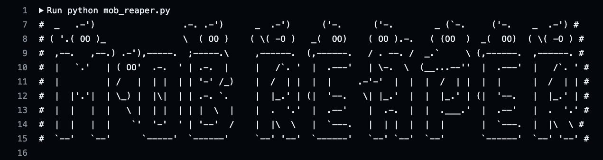

# MobReaper: Runtime Mobile Application Test Suite

## Get Started - Dependencies

### Python
MobReaper requires [Python](https://www.python.org/) to be installed.

### Genymotion
Setup genymotion on your device: https://www.genymotion.com/product-desktop/download/

At this moment, the key recommended device definitions are:

- Android Version: 11.0
- Architecture: arm64

### Rooted Device

It is highly recommended to run on a **rooted** device. Not achieving this can affect the results of the tests

### Android Debug Bridge

ADB is **required**. Ensure that it is properly configure in the local machine [adb](https://developer.android.com/tools/adb)

### Local Action Runner

To run in github Actions environment, it is needed to configure a Local Self-hosted runner on your machine.

To settup, follow the Github [Doc](https://docs.github.com/en/actions/hosting-your-own-runners/managing-self-hosted-runners/about-self-hosted-runners)

Make sure the Local runner is up and listening for jobs before start the workflow.

## (Additional) Burp Suite

It is recommendaded but no required that you have Burp Suite Pro up and running in order to scan for WEB vulnerabilities

* [PortSwigger](https://portswigger.net/burp)
* [Android Config](https://portswigger.net/burp/documentation/desktop/mobile/config-android-device)

Once the burp certificate is configured in the device, keep it ready while the tests are performed, the proxy will be set by default to `10.0.3.2` on port `8082`,
to change it, set directly on ` .env ` file