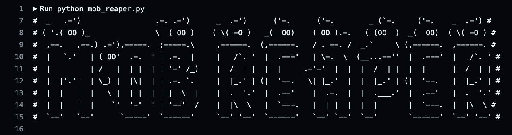

# MobReaper: Runtime Mobile Application Test Suite

[](https://github.com/cassio-santos-ptk/mobile-automated-workflow/commits/main/)
[](https://github.com/cassio-santos-ptk/mobile-automated-workflow/graphs/contributors)



---

## Architecture Overview

MobReaper is an AI-guided Mobile DAST (Dynamic Application Security Testing) framework powered by Claude. Instead of hand-coded per-app modules, Claude acts as the operator: it reasons over the live device, the decompiled APK, and captured traffic to decide which OWASP MASTG tests to run, in which order, and how to prove each finding.

The workflow relies on four cooperating MCP servers:

| MCP Server          | Role                                                                            |
| ------------------- | ------------------------------------------------------------------------------- |
| **jadx-mcp-server** | Static analysis — decompile APK, read manifest, search classes/strings          |
| **mobile-mcp**      | UI automation — drive the emulator, tap, type, screenshot                       |
| **frida**           | Runtime instrumentation — hook methods, bypass root/SSL detection, trace crypto |
| **mcp-cli-exec**    | Mac-side shell — adb, mitmproxy lifecycle, sqlite3, file pulls, logcat          |

---

## Requirements

### macOS

A Mac host machine is required. The proxy (`mitmproxy`) and ADB run on the Mac and communicate with the Genymotion emulator over localhost.

### Python 3.12

Python 3.12 is required for running Frida instrumentation scripts.

```bash
brew install python@3.12
```

Verify:

```bash
python3.12 --version
```

### Android Debug Bridge (ADB)

ADB must be installed and accessible from the terminal.

```bash
brew install android-platform-tools
```

Verify connectivity to Genymotion (once the emulator is running):

```bash
adb connect 127.0.0.1:6555
adb -s 127.0.0.1:6555 shell echo "connected"
```

### mitmproxy

Used to capture and inspect HTTPS traffic from the emulator.

```bash
brew install mitmproxy
```

Verify:

```bash
mitmdump --version
```

### Frida

Install the Frida Python bindings and the CLI tools:

```bash
pip3.12 install frida frida-tools --break-system-packages
```

Verify:

```bash
frida --version
```

The `frida-server` binary must also be present on the emulator at `/data/local/tmp/frida-server`. Download the matching version from [https://github.com/frida/frida/releases](https://github.com/frida/frida/releases) (match the Frida Python version you installed, architecture `x86_64` for Genymotion).

Push it to the device:

```bash
adb -s 127.0.0.1:6555 push frida-server /data/local/tmp/frida-server
adb -s 127.0.0.1:6555 shell chmod 755 /data/local/tmp/frida-server
```

### Report Generation Dependencies

```bash
pip3.12 install weasyprint jinja2 --break-system-packages
```

---

## Genymotion Setup

### 1. Install Genymotion Desktop

Download from [https://www.genymotion.com/product-desktop/download/](https://www.genymotion.com/product-desktop/download/) and follow the installer.

A personal (free) license is sufficient for local testing.

### 2. Create a Virtual Device

Recommended device configuration:

- **Android Version:** 11.0 (API 30)
- **Architecture:** x86_64
- **Template:** Google Pixel 5 (or any phone-form-factor template)
- **RAM:** 4 GB minimum

> The emulator must expose ADB on `127.0.0.1:6555`. This is Genymotion's default — do not change it.

### 3. Root Access

Genymotion images are rooted by default. No additional action is needed. Root is required for:

- Installing the mitmproxy CA as a system-trusted certificate
- Reading app data via `adb shell su -c` when `run-as` is unavailable

### 4. Connect ADB

Once the virtual device is running:

```bash
adb connect 127.0.0.1:6555
adb devices
# Should show: 127.0.0.1:6555  device
```

---

## MCP Server Configuration

All four MCP servers must be configured in your Claude Code / Cowork `settings.json` (or `.claude/settings.json`). Add the following blocks:

### jadx-mcp-server

Provides APK decompilation and static analysis tools.

```json
"jadx-mcp-server": {
  "command": "node",
  "args": ["/path/to/mobile-security-workflow/jadx-mcp-server/build/index.js"],
  "env": {}
}
```

The server bridges JADX-GUI (which must be open with the target APK loaded) over a local socket on port `8085`. See `jadx-mcp-server/README.md` for build instructions:

```bash
cd jadx-mcp-server
npm install
npm run build
```

### mobile-mcp

Drives the Genymotion emulator UI via Android accessibility APIs.

```json
"mobile-mcp": {
  "command": "npx",
  "args": ["-y", "@mobile-dev-inc/mobile-mcp@latest"],
  "env": {}
}
```

### frida (mcp-frida)

Provides Frida attach/spawn/hook tools.

```json
"mcp-frida": {
  "command": "uvx",
  "args": ["mcp-frida"],
  "env": {}
}
```

### mcp-cli-exec

Executes shell commands on the Mac host (adb, mitmproxy, sqlite3, etc.).

```json
"mcp-cli-exec": {
  "command": "npx",
  "args": ["-y", "mcp-cli-exec"],
  "env": {}
}
```

### Full `mcpServers` block example

```json
{
  "mcpServers": {
    "jadx-mcp-server": {
      "command": "node",
      "args": [
        "/Users/yourname/projects/mobile-security-workflow/jadx-mcp-server/build/index.js"
      ],
      "env": {}
    },
    "mobile-mcp": {
      "command": "npx",
      "args": ["-y", "@mobile-dev-inc/mobile-mcp@latest"],
      "env": {}
    },
    "mcp-frida": {
      "command": "uvx",
      "args": ["mcp-frida"],
      "env": {}
    },
    "mcp-cli-exec": {
      "command": "npx",
      "args": ["-y", "mcp-cli-exec"],
      "env": {}
    }
  }
}
```

---

## Credentials (Optional)

If the target app requires authentication, create a `.env` file at the root of this repository:

```bash
cp .env-sample .env
```

Edit `.env` with the test credentials:

```
USER_NAME=pentester01
EMAIL=pentester@example.com
PASSWORD=Sup3rS3cret!
PIN=1234
```

Claude will automatically load this file at the start of every session and use these values to fill login forms without prompting you. The `.env` file is git-ignored and never copied into the evidence directory.

---

## How to Run

### 1. Start Genymotion and launch the virtual device

Make sure the device is visible in `adb devices` before proceeding.

### 2. Install the target APK (if not already installed)

```bash
adb -s 127.0.0.1:6555 install /path/to/app.apk
```

### 3. Start Claude (Cowork or Claude Code)

Open this repository as your workspace. Claude will read `CLAUDE.md` and be ready to operate.

### 4. Give Claude your brief

Provide a package name and (optionally) the functionality to assess:

```
Package: com.example.app
Functionality: Login
```

Or just a package for a full assessment:

```
Package: com.example.app
```

Claude will then autonomously execute all phases — preflight checks, static recon, instrumentation, UI driving, MASTG test loops, evidence consolidation, and PDF report generation — surfacing findings and evidence directly in chat.

---

## Infrastructure Claude Sets Up Automatically

Claude handles the following on every run (skipping steps that are already healthy):

| Step                   | What happens                                                                   |
| ---------------------- | ------------------------------------------------------------------------------ |
| **mitmproxy**          | Starts `mitmdump` listening on port `8080`, writing to `/tmp/capture.flow`     |
| **Emulator proxy**     | Sets the Genymotion HTTP proxy to `<your Mac IP>:8080`                         |
| **System CA install**  | Pushes the mitmproxy CA cert as a system-trusted certificate via a tmpfs mount |
| **frida-server**       | Starts the frida-server binary on the device                                   |
| **Evidence directory** | Creates `evidence/<YYYY-MM-DD_HHMM>_<package>/` with all subdirectories        |

After the run, teardown is:

```bash
adb -s 127.0.0.1:6555 shell "settings put global http_proxy :0"
pkill mitmdump
adb -s 127.0.0.1:6555 shell "pkill frida-server"
```

---

## Repository Structure

```
mobile-security-workflow/
├── .env                    # Local credentials — NOT committed
├── .env-sample             # Template — copy to .env and fill in values
├── CLAUDE.md               # Workflow contract and full test catalog
├── README.md               # This file
│
├── assets/                 # Report branding (logos, cover hero)
├── apks/                   # Pulled APKs (one per target package)
│
├── scripts/
│   ├── generate_report.py  # PDF report generator (WeasyPrint + Jinja2)
│   ├── findings_schema.json
│   ├── ssl_bypass.py       # Universal SSL pinning bypass
│   ├── root_bypass.py      # Root detection bypass template
│   ├── crypto_inspect.py   # Cipher / key / IV hook
│   ├── prefs_writer.py     # SharedPreferences write hook
│   ├── webview_trace.py    # WebView URL + JS interface hook
│   ├── clip_trace.py       # Clipboard copy hook
│   └── intent_dump.py      # startActivity / sendBroadcast hook
│
└── evidence/               # Session evidence — NOT committed
    └── <YYYY-MM-DD_HHMM>_<package>/
        ├── findings.json
        ├── INDEX.txt
        ├── static/
        ├── dynamic/
        ├── frida/
        ├── screenshots/
        ├── traffic/
        └── <session>_report.pdf
```

---

## References

- [OWASP MASTG](https://mas.owasp.org/MASTG/)
- [OWASP MASVS](https://mas.owasp.org/MASVS/)
- [Frida Documentation](https://frida.re/docs/)
- [mitmproxy Documentation](https://docs.mitmproxy.org/)
- [jadx-mcp-server](./jadx-mcp-server/README.md)
